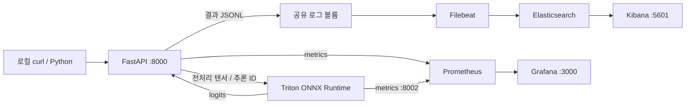

# PRD: MobileNet 이미지 분류 및 관측 시스템

- 작성일: 2026-09-13
- 상태: 사용자 승인 후 구현 및 실제 ARM64 CPU 런타임 검증. 상세 결과는 ../../verification.md 참조.
- 대상: 로컬 개발자와 추론 서비스 운영자

## 1. 목적과 완료 조건

사용자가 로컬에서 이미지 파일을 FastAPI 컨테이너에 전송하면 실제 Triton Inference Server가 MobileNet 추론을 수행한다. API는 분류 레이블과 확률을 반환하며, 같은 요청의 결과와 지연시간을 Kibana에서 검색한다. Grafana에서는 두 서버의 처리량, 오류와 지연 추이를 확인한다.

완료는 코드 작성이 아니라 실제 이미지 요청 → Triton 추론 → JSON 응답 → Elasticsearch 색인 → Kibana 조회 및 Grafana 메트릭 조회가 모두 확인된 상태다. 모의 응답이나 FastAPI 내부 모델 실행은 종단 간 검증을 대체하지 않는다.

## 2. 환경 및 접근 방식

최초 확인한 환경은 Apple M1 Max MacBook Pro, macOS arm64, 물리 메모리 64GB, Docker Desktop Linux aarch64, Docker 메모리 약 15.6 GiB, CPU 10개다. 시작 당시 기존 프로젝트 파일과 컨테이너는 없었다.

| 접근 | 장점 | 제약 | 결정 |
|---|---|---|---|
| 로컬 Docker CPU 추론 | 현재 장비에서 전체 흐름 재현 | Triton 이미지와 ONNX 백엔드 아키텍처 검증 필요 | 기본 |
| 원격 Linux NVIDIA GPU | GPU 성능 및 운영 환경에 가까움 | 별도 호스트 필요 | 추후 확장 |
| FastAPI 프로세스 내 ONNX 실행 | 설치 단순 | Triton 요구사항 미충족 | 제외 |

Triton 공식 이미지에서 ARM 및 ONNX Runtime 실행을 우선 확인한다. 실패하면 linux/amd64 에뮬레이션을 검증한다. 두 경로가 실패하면 오류와 재현 명령을 기록하고 실제 Linux 호스트가 필요한 항목을 명시한다. 에뮬레이션 측정값을 GPU 성능으로 해석하지 않는다.

의존성과 이미지 태그는 구현 시 호환성을 확인하여 고정하고, 실행 검증 보고서에 실제 버전과 이미지 digest를 기록한다. latest 태그는 사용하지 않는다.

## 3. 범위

포함: 사전 학습 MobileNetV2, ONNX 내보내기, ImageNet 레이블, 이미지 업로드 API, Triton 모델 상태 및 load/unload API, Docker Compose, JSON 로깅, Filebeat, Elasticsearch, Kibana, Prometheus, Grafana, 테스트, 실행 가이드.

제외: 모델 재학습, 사용자별 인증 시스템, Kubernetes, 자동 확장, 공개 인터넷 배포, 정확도 보장 및 GPU 성능 최적화. 모델 제어는 고정된 mobilenet_v2 모델에 한정하고 Docker 데몬 제어 API는 제공하지 않는다.

## 4. 구조와 책임



FastAPI: 입력 검증, 전처리, 비동기 Triton 호출, softmax/top-k, 구조화 로그, API 메트릭. Triton: ONNX 실행 및 모델 생명주기. Filebeat: JSONL 수집과 전송. Elasticsearch: 필드 타입과 검색. Kibana: 요청별 결과 조회. Prometheus/Grafana: 시계열 운영 메트릭.

## 5. 모델 계약

- 모델명 mobilenet_v2, 버전 1, torchvision MobileNet_V2_Weights.IMAGENET1K_V2.
- labels.json은 해당 weights의 categories에서 함께 생성하고 클래스 인덱스 0~999에 대응시킨다.
- 입력은 RGB, 짧은 변 232 bilinear resize, 중앙 224 crop, 0~1 rescale, ImageNet mean/std 정규화, FP32 NCHW [1,3,224,224]. EXIF 방향을 적용한다.
- ONNX 출력은 FP32 logits [1,1000]. 안정적인 softmax를 FastAPI에서 한 번 적용한다. probability는 softmax 점수이며 보정된 신뢰도로 간주하지 않는다.
- top-k 기본 5, 허용 1~10, 확률 내림차순. 같은 점수는 클래스 인덱스로 정렬하여 재현성을 확보한다.
- CPU instance group과 배치 1을 기본으로 한다. 초기 구현에서 dynamic batching은 사용하지 않는다.
- export는 eval 모드이며 체크포인트·ONNX·레이블 SHA256과 패키지 버전을 manifest에 기록한다.

## 6. API 요구사항

| 메서드와 경로 | 동작 | 정상 응답 |
|---|---|---|
| POST /v1/classify?top_k=5 | multipart file 이미지 추론 | 200, request_id/model/version/predictions/timing |
| GET /health/live | API 프로세스 생존 | 200 |
| GET /health/ready | Triton 및 모델 준비 상태 | 준비 200, 미준비 503 |
| GET /v1/models/mobilenet_v2 | 모델 준비 상태와 메타데이터 | 200 |
| POST /v1/models/mobilenet_v2/load | 명시적 모델 로드 후 준비 확인 | 성공 200 |
| POST /v1/models/mobilenet_v2/unload | 모델 언로드 | 성공 200 |
| GET /metrics | Prometheus exposition | 200 |

모델 제어 엔드포인트는 환경변수 ADMIN_API_KEY와 X-API-Key 헤더를 비교한다. 키가 없으면 제어 기능을 비활성화한다. 키는 로그에 기록하지 않는다. Triton은 explicit model-control 모드로 시작하고 초기 모델을 로드한다.

이미지 제한: JPEG/PNG, 업로드 최대 10 MiB, 최대 20 megapixels, 디코딩된 포맷 확인. 빈 파일/손상 이미지는 400, 초과 크기는 413, 지원하지 않는 형식은 415, 잘못된 top_k는 422. Triton 미준비/연결 실패는 503, 30초 추론 타임아웃은 504, 비정상 tensor/NaN 출력은 502로 구분한다. 응답에 내부 stack trace를 노출하지 않는다.

모든 요청에 서버 생성 UUID request_id를 부여하고 응답 본문·X-Request-ID·로그·Triton inference request ID에 전달한다. 동시 추론은 기본 4개로 제한하고 대기 한도 초과는 429로 반환한다.

응답 예시(설명용 값, 실제 추론 결과가 아님):

```json
{"request_id":"example-id","model":"mobilenet_v2","version":"1","predictions":[{"rank":1,"class_id":207,"label":"golden retriever","probability":0.87}],"timing":{"preprocess_ms":4.2,"triton_roundtrip_ms":28.1,"postprocess_ms":0.3,"total_ms":33.4}}
```

## 7. Logger 설계: Kibana에서 결과를 보이게 하는 방법

### 7.1 기록 위치

Triton 운영 로그를 활성화하는 것만으로 업무용 label/probability 문서가 만들어지지는 않는다. 결과를 해석하는 FastAPI 계층에서 Triton 응답을 후처리한 직후 inference.completed 이벤트를 기록한다. 순수 서버 내부 추론시간은 별도의 Triton 메트릭으로 관측한다.

Python logging에 JSON Formatter를 적용한다. UTC ISO8601 @timestamp, log.level, service.name, event.action을 공통 필드로 사용한다. JSON은 한 이벤트 한 줄이며 예외 stack trace도 JSON 문자열로 이스케이프한다. allow_nan=False로 비표준 JSON을 차단한다.

stdout StreamHandler와 /var/log/inference/events.jsonl의 RotatingFileHandler를 사용한다. 로컬 기본은 Uvicorn worker 1, 로그 파일 10 MiB × 백업 5개다. Filebeat는 파일만 수집하여 stdout과 중복 색인하지 않는다. 다중 worker 확장은 별도 로그 수집 방식 변경이 필요하다.

### 7.2 필드와 Elasticsearch 매핑

| 필드 | 타입 | 의미 |
|---|---|---|
| @timestamp | date | 완료 또는 실패 시각 UTC |
| service.name / log.level | keyword | fastapi / INFO 또는 ERROR |
| event.id | keyword | 이벤트 UUID, 색인 document ID로 중복 억제 |
| event.action / event.outcome | keyword | inference.completed 또는 inference.failed / success 또는 failure |
| request.id | keyword | 응답과 로그 연결 |
| model.name / model.version | keyword | 실제 호출 모델과 버전 |
| classification.label | keyword | top-1 레이블 |
| classification.class_id | integer | top-1 클래스 |
| classification.probability | double | top-1 확률, 0~1 |
| classification.top_k | nested | rank/class_id/label/probability 쌍 보존 |
| latency.preprocess_ms | double | 전처리 소요시간 |
| latency.triton_roundtrip_ms | double | Triton 호출의 네트워크·큐·실행·응답 포함 시간 |
| latency.postprocess_ms | double | softmax와 결과 생성 시간 |
| latency.total_ms | double | API 처리 시작부터 결과 생성까지, 업로드 전송 및 최종 응답 전송 시간 제외 |
| event.duration | long | 같은 total 시간의 나노초 값 |
| http.response.status_code | integer | API 상태 코드 |
| error.type / error.message | keyword / text | 실패 분류와 정제한 설명 |

이미지 바이트, 원본 파일명, API 키, 전체 요청 헤더는 기록하지 않는다. 실패 시 확률과 레이블을 가짜 값으로 채우지 않는다. 시간 측정은 perf_counter를 사용한다. latency.triton_roundtrip_ms를 순수 model compute latency라고 표시하지 않는다.

### 7.3 Filebeat와 Elasticsearch

공유 볼륨을 FastAPI에는 쓰기, Filebeat에는 읽기 전용으로 마운트한다. filestream + ndjson parser로 회전 파일까지 읽고 오류 필드를 활성화한다. 최초 한 요청부터 수집되도록 선택한 Filebeat 버전의 fingerprint 최소 길이/파일 식별 기본값을 검증한다. registry는 별도 영속 볼륨에 저장한다.

Elasticsearch 준비 후 index template을 먼저 생성하고 Filebeat를 시작한다. inference-events-*에 명시적 필드 매핑을 적용하며 보관 기간은 7일로 설정한다. event.id를 document ID로 사용한다. 수집의 exactly-once를 보장하지 않으며 재전송에 따른 중복을 억제한다. Filebeat 중단 시 로컬 회전 로그 보관량을 초과하면 손실될 수 있음을 실행 가이드에 명시한다.

### 7.4 Kibana

부트스트랩 스크립트는 inference-events-* data view, @timestamp 시간 필드, 기본 Discover 조회와 dashboard를 반복 실행 가능하게 생성한다. 표의 기본 컬럼은 시간, request.id, model.name, classification.label, classification.probability, latency.triton_roundtrip_ms, latency.total_ms, event.outcome이다.

제공 조회: request.id 일치 검색, classification.probability < 0.5, event.outcome: failure, label 필터. 시각화는 top-1 레이블 분포, 확률 분포, 지연 p50/p95, 성공/실패 건수를 제공한다. nested top-k는 원본 문서에서 쌍을 확인하며 기본 시각화는 top-1 평탄 필드를 사용한다.

## 8. Grafana 및 Prometheus

수집 주기 5초, 보관 7일. FastAPI 메트릭은 요청 카운터, HTTP/추론 지연 histogram, 진행 중 요청 gauge, upstream 오류 카운터를 제공한다. 메트릭 label에는 route template/method/status/model만 허용하고 request_id, 파일명, 분류 레이블은 넣지 않는다.

Grafana provisioning으로 Prometheus datasource와 대시보드를 자동 생성한다. 패널: FastAPI RPS, 오류율, p50/p95 지연, 진행 중 요청, Triton 성공/실패, 요청/큐/compute 평균 지연, 모델별 요청량, up 상태. 데이터가 없으면 성공이나 0 지연으로 오해되지 않도록 No data로 표시한다.

Triton 평균 추론 계산 지연은 rate(nv_inference_compute_infer_duration_us[1m]) / rate(nv_inference_request_success[1m]) / 1000 형태로 모델·버전별 표시한다. 실제 제공 메트릭과 분모 의미를 선택 버전에서 확인한다. Triton 누적 카운터로 개별 요청 p95를 계산하지 않는다. API p95는 histogram_quantile과 histogram bucket으로 구한다.

## 9. Docker 운영과 재현성

Compose 서비스: model-export(일회성), triton, api, elasticsearch, kibana, filebeat, prometheus, grafana, observability-init(일회성). 모델과 labels는 같은 export 산출물을 읽는다.

호스트 공개 포트는 127.0.0.1에 바인딩한다: API 8000, Kibana 5601, Grafana 3000. 진단이 필요한 Elasticsearch 9200/Prometheus 9090도 loopback만 허용한다. Triton은 Compose 내부 통신을 기본으로 한다. Docker socket을 API에 마운트하지 않는다.

로컬 Elasticsearch는 single-node이며 보안 비활성화가 필요한 경우 loopback 및 격리 네트워크에 한정한다. Grafana 자격증명과 ADMIN_API_KEY는 git에서 제외한 .env로 주입한다. .env.example에는 실제 비밀이 없는 예시만 둔다.

healthcheck, 준비 완료 대기, 자원 제한, 영속 볼륨을 구성한다. 기본 종료는 볼륨을 보존한다. 데이터 삭제 명령은 별도로 설명하고 자동 실행하지 않는다.

## 10. 구현 산출물

| 위치 | 책임 |
|---|---|
| app/main.py, settings.py | 라우팅·설정·생명주기 |
| app/inference.py, preprocessing.py | Triton 호출·이미지 처리·결과 계약 |
| app/logging_config.py, metrics.py | 구조화 로그·메트릭 |
| scripts/export_model.py | ONNX·레이블·manifest 생성 |
| model_repository/mobilenet_v2/config.pbtxt | Triton CPU 설정 |
| docker-compose.yml, Dockerfile | 서비스 구성·API 이미지 |
| observability/ | Filebeat·매핑·Kibana·Prometheus·Grafana 설정 |
| scripts/bootstrap_observability.py | 템플릿·data view·dashboard 생성 |
| scripts/smoke_test.py | 실제 추론부터 로그 및 메트릭까지 검증 |
| tests/ | 전처리·후처리·API·로그·통합 테스트 |
| README.md | 설치·기동·curl·조회·종료·트러블슈팅 |
| docs/verification.md | 명령·실측 결과·환경·미검증 항목 |

## 11. 테스트와 수용 기준

| ID | 검증 | 통과 기준 |
|---|---|---|
| AC-01 | 모델 export 검증 | ONNX checker 통과, 동일 입력 PyTorch/ONNX logits allclose(rtol=1e-3, atol=1e-4) |
| AC-02 | 전처리 | 공식 weights transforms와 수치 비교 및 RGB/회전/크기 검증 |
| AC-03 | 후처리 | 1,000 logits softmax 합 ≈1, finite, top-k 순서 및 레이블 인덱스 정확 |
| AC-04 | 실제 이미지 분류 | 출처·SHA256이 기록된 샘플의 기준 PyTorch top-1과 Triton API top-1 일치 |
| AC-05 | API 오류 | 손상/초과 크기/형식/top_k/timeout에 정의한 상태 코드와 request_id |
| AC-06 | 모델 제어 | 인증 없는 제어 거절; unload 후 readiness 503, load 후 분류 복구 |
| AC-07 | 로그 수집 | 실제 요청 후 60초 내 request.id 문서 검색, 응답과 label/probability 일치, 매핑이 숫자 타입 |
| AC-08 | Kibana | data view와 dashboard 존재, UI에서 동일 request.id 및 수치 조회 |
| AC-09 | Grafana | scrape target up, 실제 요청 후 카운터 증가, 대시보드 쿼리가 유효한 수치 반환 및 UI 렌더링 |
| AC-10 | 장애 복구 | Filebeat 중단 중 요청 후 재기동 시 보관된 이벤트 수집 |
| AC-11 | 반복 실행 | export/부트스트랩/Compose 재실행으로 중복 대시보드 또는 데이터 삭제 없음 |
| AC-12 | 부하 관측 | 워밍업 5회 후 동시성 1 및 4에서 각 20회 요청, 성공률·p50/p95·아키텍처 기록 |

목표 성능 수치는 하드웨어와 실행 경로를 확인한 실측 보고서에서 제시한다. 현재 PRD에서 지연 보장값을 임의로 선언하지 않는다. 단위 테스트는 테스트 우선으로 작성하고 실패 확인 후 구현한다. 외부 의존성 모의 테스트와 실제 Docker 종단 간 테스트의 결과를 구분한다.

## 12. 진행 상태 및 다음 단계

완료: 요구사항 분해, 설계 문서, ARM64 모델 export, API 및 관측 구현, 실제 컨테이너 기동, 단위/종단 간/복구/부하 검증. 검증 증거와 장기 테스트 미수행 범위는 docs/verification.md에 기록한다.

승인된 계획에 따라 모델/API → 로그/Kibana → 메트릭/Grafana → 통합 검증을 진행했다. 발견한 오류는 수정과 재검증 결과를 함께 기록했다.

## 13. 공식 참고 자료

- [Torchvision MobileNetV2](https://docs.pytorch.org/vision/stable/models/generated/torchvision.models.mobilenet_v2.html): 가중치, 레이블과 전처리 계약.
- [Triton backend platform support](https://docs.nvidia.com/deeplearning/triton-inference-server/user-guide/docs/backend/docs/backend_platform_support_matrix.html): 플랫폼별 백엔드 지원 확인.
- [Triton metrics](https://docs.nvidia.com/deeplearning/triton-inference-server/user-guide/docs/user_guide/metrics.html): 메트릭 이름과 시간 단위.
- [Triton model management](https://docs.nvidia.com/deeplearning/triton-inference-server/user-guide/docs/user_guide/model_management.html): explicit 모델 제어.
- [Filebeat filestream](https://www.elastic.co/docs/reference/beats/filebeat/filebeat-input-filestream): JSON 라인 수집과 파일 식별.
